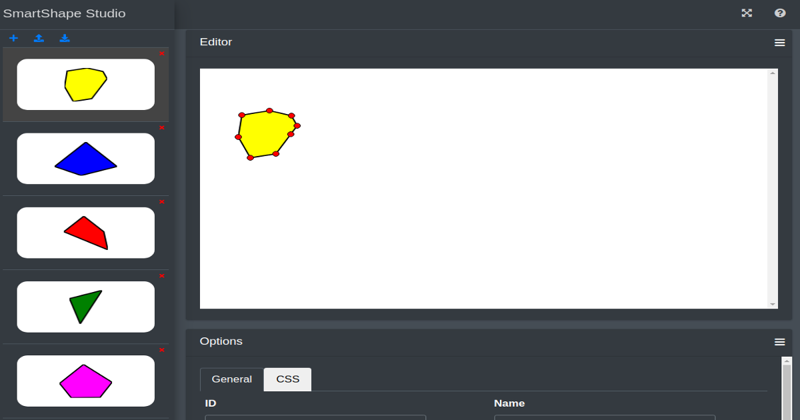

# SmartShape Studio
Visual design tool for SmartShape shapes and libraries of shapes. Using this tool you can design new shapes from scratch or import vector graphics from external formats like SVG or webfonts and convert them to shapes ( in future versions ).

<p align="center">



</p>

Try this online: https://shapes.germanov.dev/

This tool should be used with [SmartShape](https://github.com/AndreyGermanov/smart_shape) library.

Without this tool, you can create shapes using API, by providing set of points which form the shape and options, that define the look of the shape. The `Studio` provides alternative visual way which can be more comfortable to create complex shapes and big collections of shapes than writing all this in code.

Using the editor, you can add shapes, design them, set their options, including `ID` and `name` and save them to a JSON file. **It's important to provide unique ID for each shape to address it later in the code**. Later you can load the JSON file to the editor to modify any created shapes or add new ones. 

Finally, created collection of shapes can be loaded to the code of your project, that uses SmartShape. SmartShape provides an extended API, which makes vector figures interactive: you can drag/resize/rotate these figures and communicate with them using event subsystem.

For example, if you designed a collection of shapes and saved them as a `collection.json`, you can later load them to you SmartShape project by `SmartShapeManger` object:

```html
<div id="app" style="width:100%;height:600px"></div>
```

```javascript
import {SmartShapeManager} from "smart_shape";

// Import saved collection as a JSON object
import collectionJson from "./collection.json";

// Create link to the container to put shapes in 
const div = document.querySelector("#app");

// Read shapes from file and put to container
SmartShapeManager.fromJSON(collectionJson);

// Get all imported shapes as an array
const shapes = SmartShapeManager.getShapes();

// Get shape by ID
const shape1 = SmartShapeManager.findShapeById("shape1");

shape1.addEventListener("click", (event) => {
    // Do something when user clicks on this shape
})

// Get another shape by ID
const shape2 = SmartShapeManager.findShapeById("shape2");

// Move shape to other place of the screen
shape2.moveTo(200,100)

// and so on ...
```

All actions that you can do with shapes after loading them you can find in [SmartShape API](https://github.com/AndreyGermanov/smart_shape/blob/main/docs/API.md#SmartShape).


